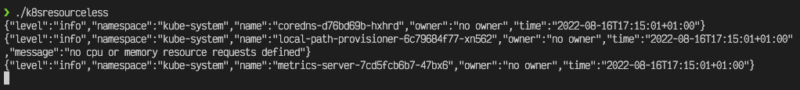

# k8sresourcesless

A utility to find all Kubernetes Pod resources that have no CPU or memory resource requests defined for their containers.

The tool uses the informer pattern to monitor for both existing & newly created Pods in the cluster, checks for resource request definitions, and reports any Pod that does not have them set.

## Why are resource requests important?

Kubernetes uses Pod resource requests to determine on which node to schedule the pod. The kube-scheduler will look at the resources defined for each container in the Pod specification, and find a suitable node that has enough resources to accomodate that Pod.

If the Pod does not define resource requests for either CPU or memory, then unless there has been a `LimitRange` defined for the Namespace in which your Pod runs, effectively enforcing you to set resource requests, then the following scenarios can occur:

- No CPU requests: more Pods "seem" to be able to work on the same node, but during bursts in traffic, node CPU can become maxed out and everythig grinds to a halt.
- No memory requests: again, more pods "seem" to be able to run on a node, but pods can be restarted whe they try to access more memory but there is not enough on the node.

This tool aims to identify workloads that have either no CPU or memory requests defined, so you can start to get a picture of where you need to set them, as well as where setting Limit Ranges can help.

## Running Locally

Build the project:

```bash
go build -o k8sresourceless ./cmd
```

Ensure you have access to the target Kubernetes cluster & run the tool:

```bash
./k8sresourcesless
```

## Running In Kubernetes

TBC

## Program Output

The tool, by default, will output to the stdout stream in JSON format. This makes it easy to pick up the logs via logging agents etc.

The JSON output has the following fields:

- `level` - log level
- `namespace` - the Pod namespace
- `name` - the name of the Pod
- `owner` - the value of the `owner` label, or `no owner` if not set. Useful for finding workload owners
- `time` - time the log was generated

More output options will be added in the future (e.g. send to slack).



## Running Tests

Run tests via `go test`:

```bash
go test -v ./...
```
